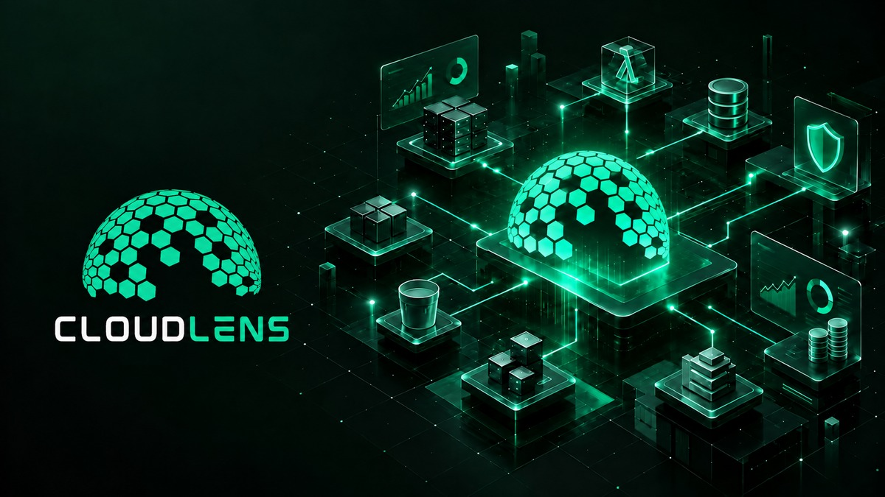
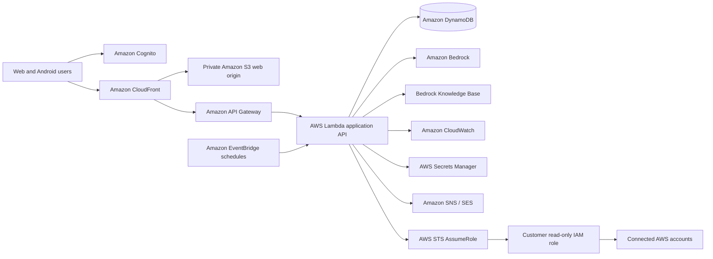
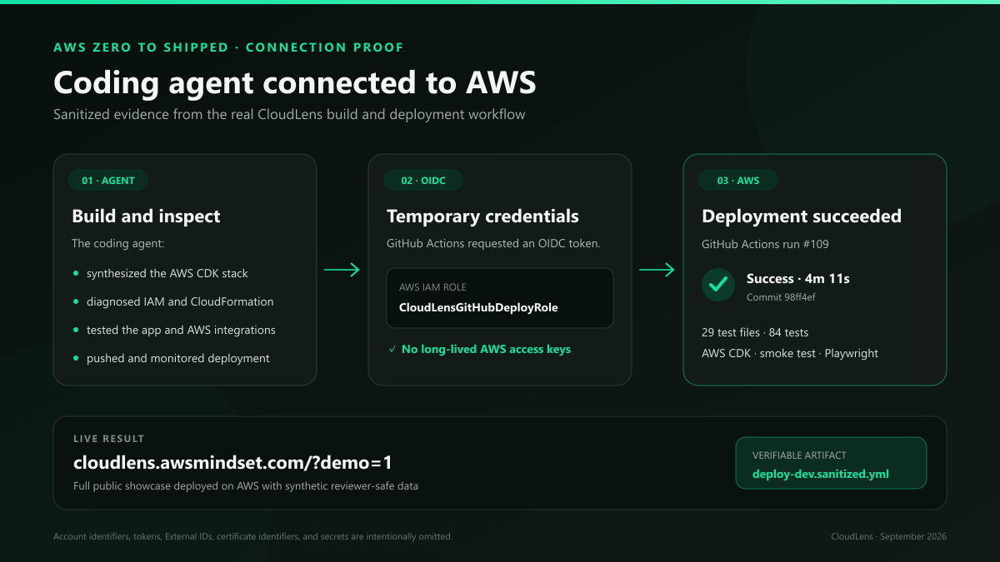

# CloudLens — AWS Architecture Intelligence

CloudLens is a multi-tenant SaaS platform that discovers AWS infrastructure through customer-owned read-only roles, builds a living dependency graph, tracks changes, and uses Amazon Bedrock to explain architecture, reliability, security, and cost risks with evidence from the connected environment.

This is the **sanitized public showcase** for the CloudLens AWS Zero to Shipped submission. It documents the shipped system, development process, security boundaries, and coding-agent workflow without publishing tenant data, deployment identifiers, credentials, or the proprietary production repository.

## Try the live application

**Public judge demo:** https://cloudlens.awsmindset.com/?demo=1  
**Authenticated application:** https://cloudlens.awsmindset.com

The application runs on AWS. Authentication is provided by Amazon Cognito. Customer accounts are connected with a customer-deployed read-only IAM role, a unique External ID, and short-lived AWS STS credentials. Users never paste long-lived AWS access keys into CloudLens.

The judge demo is intentionally backed by synthetic data so automated and human reviewers can inspect the product without receiving customer credentials. It does not bypass authentication for live AWS inventory.

## What CloudLens ships

- Cross-account AWS resource discovery
- Searchable architecture inventory and dependency graph
- Resource dependencies and blast-radius analysis
- Scheduled snapshots and configuration-change comparison
- Change-risk scoring for added, modified, and removed resources
- CloudWatch telemetry and incident intelligence
- Security posture findings with remediation tracking
- Cost Explorer trends, forecasts, anomalies, and FinOps opportunities
- Amazon Bedrock architecture reviews and evidence-grounded recommendations
- An account-aware architecture copilot
- Bedrock Knowledge Base synchronization
- AWS Organizations multi-account discovery
- Multi-tenant Cognito authentication, invitations, roles, limits, and isolation
- Stripe subscription lifecycle and invoice history
- React Native Android companion application

## Architecture

See [Architecture](docs/ARCHITECTURE.md) for the trust boundary, data flow, and service responsibilities.

## Coding-agent connection proof

The coding agent was connected to the AWS development workflow and helped operate the real deployment, not only generate local code. The workflow included:

- Synthesizing and deploying the AWS CDK stack
- Deploying from GitHub Actions through AWS OIDC and `CloudLensGitHubDeployRole`
- Inspecting CloudFormation failures and IAM authorization errors
- Reviewing Lambda and CloudWatch evidence during Bedrock and Stripe troubleshooting
- Configuring Cognito callbacks, logout behavior, and hosted-login branding
- Validating STS role assumption and live cross-account discovery
- Verifying Bedrock model invocation and knowledge-base synchronization
- Testing the public CloudFront/custom-domain deployment in a browser

The detailed, redacted evidence record is in [Coding-agent connection evidence](docs/CODING_AGENT_EVIDENCE.md), alongside the reviewer-safe [OIDC deployment workflow](docs/deploy-dev.sanitized.yml).

## Security model

CloudLens is read-only by default. Its cross-account pattern uses:

1. A customer-owned IAM role.
2. A CloudLens collector role as the trusted principal.
3. A unique per-connection External ID.
4. Short-lived STS credentials.
5. Tenant and account authorization checks at the API boundary.

A generic customer-role template is included at [onboarding/cloudlens-readonly-role.yaml](onboarding/cloudlens-readonly-role.yaml). It contains no account IDs or secrets.

See [Security and privacy](docs/SECURITY_AND_PRIVACY.md) for the public security boundary and redaction policy.

## Development story

CloudLens progressed from a graph-first AWS inventory into a deployed multi-tenant product: live discovery, scheduled snapshots, change and blast-radius intelligence, Bedrock analysis and chat, cost optimization, customer onboarding, billing, and mobile access.

See [Development story](docs/DEVELOPMENT_STORY.md) for the implementation narrative and technical challenges.

## Hackathon entry

- **Category:** Commercial Potential
- **Lane:** Startup
- **Live application:** https://cloudlens.awsmindset.com
- **Public judge demo:** https://cloudlens.awsmindset.com/?demo=1
- **Builder Center project:** https://builder.aws.com/project/3Ji7cd14xIExsbpQGLf3qvJB1xu/cloudlens-ai-powered-aws-architecture-intelligence

## Repository scope

This repository is intentionally a reviewable public showcase, not the deployable production source tree. The production implementation remains private to protect proprietary code and operational configuration. Nothing here contains credentials, customer data, private resource identifiers, or deployable production secrets.

## License

Documentation and original showcase assets are licensed under the terms in [LICENSE](LICENSE). AWS product names and AWS Architecture Icons remain subject to AWS trademark and asset guidelines.
