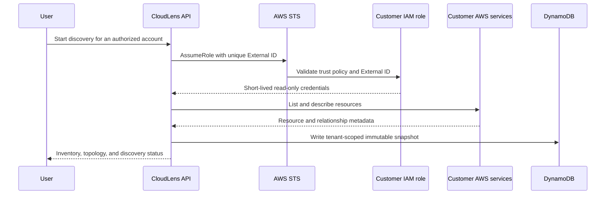

# CloudLens architecture

## System boundaries

CloudLens separates four responsibilities:

1. **Identity and tenancy** — Amazon Cognito authenticates users. Verified claims and server-side membership records determine tenant, role, and account access.
2. **Collection** — AWS Lambda assumes a customer-owned role through AWS STS using a unique External ID. Discovery is read-only and credentials are short lived.
3. **Intelligence** — normalized resources and relationships are stored as tenant-scoped snapshots. Deterministic analysis establishes dependencies and change risk before Amazon Bedrock produces explanations.
4. **Experience** — the CloudFront-hosted web application and React Native Android application consume the same authenticated API.

## AWS services

| Service | Responsibility |
|---|---|
| Amazon CloudFront | Global application delivery and custom-domain entry point |
| Amazon S3 | Private static web origin and controlled report artifacts |
| Amazon Cognito | Authentication, token lifecycle, MFA/challenges, and role claims |
| Amazon API Gateway | Public HTTPS API and JWT authorization boundary |
| AWS Lambda | Discovery, analysis, tenant administration, billing, reporting, and chat orchestration |
| Amazon DynamoDB | Tenant-scoped accounts, snapshots, findings, conversations, audit data, and usage records |
| Amazon EventBridge | Scheduled discovery, reports, and background workflows |
| Amazon CloudWatch | Metrics, alarms, logs, and operational evidence |
| Amazon Bedrock | Architecture analysis, cost guidance, remediation plans, and copilot answers |
| Bedrock Knowledge Bases | Retrieved architecture context for grounded answers |
| AWS STS | Short-lived cross-account sessions |
| AWS Secrets Manager | Server-side integration credentials |
| Amazon SNS / SES | Alerts and report delivery |

## Discovery flow

## AI grounding flow

CloudLens does not ask the model to guess an AWS environment. It assembles bounded evidence from the latest discovery snapshot, dependency graph, recent changes, cost summaries, CloudWatch signals, and security findings. Deterministic resource identifiers are retained in the response so recommendations can be traced back to evidence.

## Tenant isolation

- Tenant identity comes from verified authentication claims and server-side membership state.
- Every persistent record is scoped by tenant.
- Connected-account grants are checked independently of tenant membership.
- Administrative actions require server-side role authorization.
- Usage limits are enforced by tenant for connected accounts, members, and AI questions.
